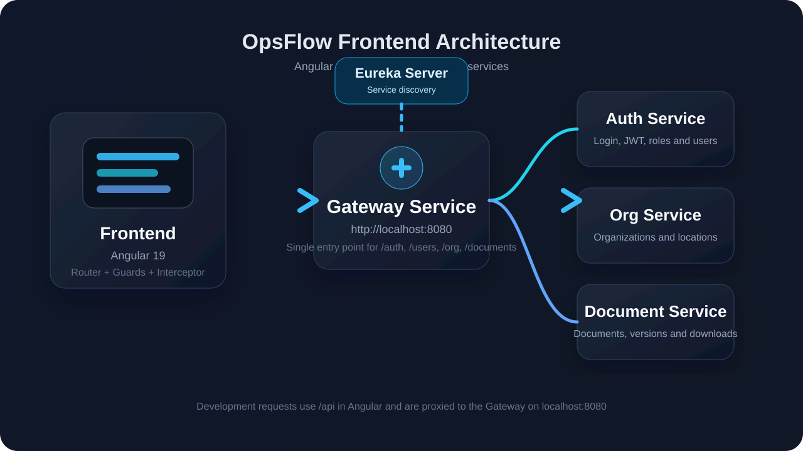
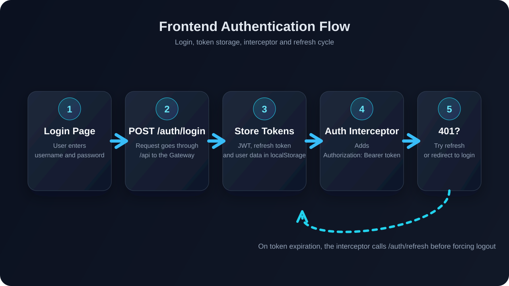

# 🚀 OpsFlow Frontend

Aplicación web de OpsFlow construida con `Angular 19`, `TypeScript 5.5` y `SCSS`. El frontend consume el backend a través del `gateway_service`, gestiona autenticación JWT, navegación protegida por roles y los flujos funcionales de usuarios, organizaciones y documentos.



---

## 👁️ Vista general

- **Framework principal:** `Angular 19`
- **Estilo de componentes:** `standalone`
- **Cliente HTTP:** `HttpClient`
- **Seguridad:** `JWT` + interceptor + guards
- **Integración backend:** `API Gateway` en `http://localhost:8080`
- **Desarrollo local:** proxy `/api` hacia el gateway

---

## ⚡ Arranque rápido

### 1. Instalar dependencias 📦

```bash
cd "c:\Cursos\Java\opsflow\opsflow-frontend"
npm install
```
### 2. Levantar el frontend en desarrollo

```bash
npm run dev
```

El frontend quedara disponible en:

```text
http://localhost:3000
```

### 3. Generar build de producción 🏗️

```bash
npm run build
```

## 📋 Prerrequisitos

Antes de ejecutar el frontend, asegurese de tener disponible:

🟢 `Node.js` compatible con `Angular CLI 19`
🟢 `npm`
🟢 backend de OpsFlow levantado, especialmente:
      - `eureka_server` en `http://localhost:8761`
      - `gateway_service` en `http://localhost:8080`
      - `auth_service`
      - `org_service`
      - `document_service`

> 💡 Nota: En desarrollo, el frontend no llama directo a cada microservicio. Todas las peticiones salen por `/api` y el proxy las redirige al gateway.

## 📜 Scripts disponibles

| Script | Descripcion |
| :--- | :--- |
| `npm run dev` | Levanta el frontend en `http://localhost:3000` con `--host 0.0.0.0` |
| `npm start` | Inicia el servidor de desarrollo de Angular |
| `npm run build` | Genera la build de produccion |
| `npm run watch` | Compila en modo desarrollo y observa cambios |
| `npm test` | Ejecuta pruebas unitarias |

### 🛠️Comandos utiles de consola

Instalar y ejecutar:

```bash
cd "c:\Cursos\Java\opsflow\opsflow-frontend"
npm install
npm run dev
```

Compilar proyecto:

```bash
cd "c:\Cursos\Java\opsflow\opsflow-frontend"
npm run build
```

Ejecutar pruebas:

```bash
cd "c:\Cursos\Java\opsflow\opsflow-frontend"
npm test
```

## 🌍Configuracion de entornos

El proyecto no usa archivos `.env`. La configuracion se centraliza en:

- `src/environments/environment.ts`
- `src/environments/environment.prod.ts`

### 🔧Desarrollo

Archivo: `src/environments/environment.ts`

- `production: false`
- `apiUrl: '/api'`
- `tokenKey: 'opsflow_token'`
- `refreshTokenKey: 'opsflow_refresh_token'`
- `userKey: 'opsflow_user'`
- `permissionsKey: 'opsflow_permissions'`
- `gatewayDocsUrl: 'http://localhost:8080/swagger-ui.html'`

### 🚀Produccion

Archivo: `src/environments/environment.prod.ts`

- `production: true`
- `apiUrl: 'https://api.opsflow.com/api'`
- `gatewayDocsUrl: 'https://api.opsflow.com/swagger-ui.html'`

⚠️Si cambia el dominio del backend o del gateway, actualice `apiUrl` y `gatewayDocsUrl`.

## 🔄Proxy de desarrollo

El frontend usa `proxy.conf.json` para reenviar llamadas locales al gateway:

```json
{
  "/api": {
    "target": "http://localhost:8080",
    "secure": false,
    "changeOrigin": true,
    "pathRewrite": {
      "^/api": ""
    },
    "logLevel": "debug"
  }
}
```

Ejemplo de traduccion de rutas:

```text
/api/auth/login  ->  http://localhost:8080/auth/login
```

Cambie `proxy.conf.json` si:

- el gateway corre en otro puerto
- el backend corre en otra maquina
- desea apuntar a otro ambiente local

## 🔐Flujo de autenticacion



La autenticacion del frontend esta distribuida en:

- `src/app/core/services/auth.service.ts`
- `src/app/core/interceptors/auth.interceptor.ts`
- `src/app/core/guards/auth.guard.ts`
- `src/app/app.config.ts`

### ⚙️Como funciona

1. El login se realiza contra `{{apiUrl}}/auth/login`.
2. El token JWT y el refresh token se guardan en `localStorage`.
3. El interceptor agrega `Authorization: Bearer <token>` a las peticiones protegidas.
4. Si una peticion responde `401`, el interceptor intenta renovar el token con `/auth/refresh`.
5. Si la renovacion falla, el usuario es redirigido al login.

### 🔑Claves usadas en `localStorage`

- `opsflow_token`
- `opsflow_refresh_token`
- `opsflow_user`
- `opsflow_permissions`

### 🔓Endpoints publicos excluidos del interceptor

- `/auth/login`
- `/auth/signup`
- `/auth/verify`
- `/auth/refresh`
- `/auth/forgot-password`
- `/auth/reset-password`

## 🧭Navegacion y seguridad

Rutas principales:

- `/auth/login`
- `/auth/register`
- `/auth/verify`
- `/auth/reset-password`
- `/dashboard`
- `/dashboard/inicio`
- `/dashboard/roles`
- `/dashboard/usuarios`
- `/dashboard/organizaciones`
- `/dashboard/documentos`
- `/unauthorized`

### 🛡️Guards activos

- `authGuard`: protege el acceso al dashboard
- `guestGuard`: evita que un usuario autenticado vuelva a login o registro
- `adminGuard`: restringe paginas administrativas como roles y usuarios

Reglas actuales:

- `dashboard/roles` requiere `ROLE_ADMIN`
- `dashboard/usuarios` requiere `ROLE_ADMIN`
- el resto del dashboard requiere autenticacion valida

## 🔌Integracion con backend

El frontend consume principalmente estos grupos de endpoints:

- `/auth`
- `/users`
- `/org`
- `/documents`

Los accesos HTTP estan centralizados en:

- `src/app/core/services/auth.service.ts`
- `src/app/core/services/admin-api.service.ts`
- `src/app/core/services/org.service.ts`

### 🚨Requisito clave

Para desarrollo local, el backend debe estar accesible desde:

```text
http://localhost:8080
```

Si el gateway no esta disponible, fallaran login, roles, usuarios, organizaciones y documentos.

## 📂Estructura relevante del proyecto

```text
opsflow-frontend/
├─ public/
│  └─ readme/
├─ src/
│  ├─ app/
│  │  ├─ core/
│  │  │  ├─ guards/
│  │  │  ├─ interceptors/
│  │  │  ├─ models/
│  │  │  └─ services/
│  │  ├─ features/
│  │  │  ├─ auth/
│  │  │  ├─ dashboard/
│  │  │  └─ unauthorized/
│  │  ├─ app.config.ts
│  │  └─ app.routes.ts
│  ├─ environments/
│  └─ styles.scss
├─ angular.json
├─ package.json
├─ proxy.conf.json
└─ tsconfig.json
```

## 🏷️Alias de imports

El proyecto define aliases en `tsconfig.json`:

- `@app/*` -> `src/app/*`
- `@core/*` -> `src/app/core/*`
- `@shared/*` -> `src/app/shared/*`
- `@env/*` -> `src/environments/*`

Use estos aliases para mantener imports mas limpios y consistentes.

## 🛠️Configuracion de compilacion

Datos relevantes de `angular.json`:

- `outputPath`: `dist/opsflow-frontend`
- `inlineStyleLanguage`: `scss`
- `development` con `sourceMap: true`
- `production` con `outputHashing: all`
- servidor dev con `proxyConfig: proxy.conf.json`

La build por defecto usa `production`.

## 🐛Troubleshooting

### El frontend no puede autenticarse

Revise:

- que `gateway_service` este arriba en `http://localhost:8080`
- que `proxy.conf.json` apunte al puerto correcto
- que el navegador no tenga tokens viejos en `localStorage`

Puede limpiar manualmente:

```bash
# Limpie estas claves desde las herramientas del navegador:
opsflow_token
opsflow_refresh_token
opsflow_user
opsflow_permissions
```

### Las rutas protegidas redirigen a login

Revise:

- expiracion del JWT
- funcionamiento de `/auth/refresh`
- disponibilidad del backend

### Swagger del gateway no abre

Revise el valor de:

- `gatewayDocsUrl` en `environment.ts`
- `gatewayDocsUrl` en `environment.prod.ts`

## 💡Recomendaciones para nuevos cambios

- Mantenga toda URL backend centralizada en `environment.ts`
- No codifique dominios o puertos directamente en componentes
- Use `admin-api.service.ts`, `auth.service.ts` y `org.service.ts` como punto de acceso HTTP
- Si agrega nuevos endpoints backend, actualice tambien:
  - servicios Angular
  - guards o validaciones por rol si aplica
  - coleccion de Postman
  - documentacion del backend y del frontend
